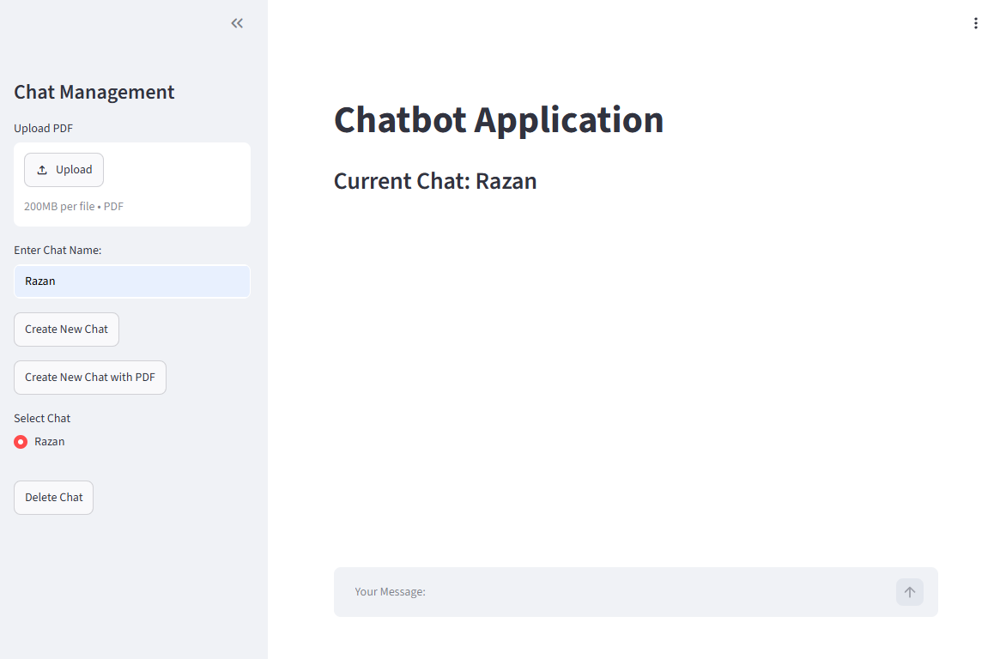

# Azure RAG Chatbot

A cloud-native chatbot application that lets users upload PDF documents and ask questions about them using Retrieval-Augmented Generation (RAG). Built with Streamlit, FastAPI, and LangChain, and deployed entirely on Microsoft Azure using Infrastructure as Code (Terraform).

## Overview

This project demonstrates a full production-style deployment of an AI-powered chat application on Azure, covering:

- Infrastructure provisioning with **Terraform**
- Managed **PostgreSQL** database for chat metadata
- **Azure Blob Storage** for chat logs and uploaded PDFs
- **ChromaDB** for vector search over document embeddings
- **Azure Key Vault** with VM Managed Identity for secret management (no secrets in code or `.env`)
- Containerized deployment via **Docker Compose** on an Azure Linux VM

## Application



The application provides a Streamlit-based interface where users can upload PDF documents, create chat sessions, and ask questions about the uploaded content using Retrieval-Augmented Generation (RAG).

## Architecture

```
┌─────────────┐      ┌──────────────┐      ┌─────────────┐
│  Streamlit   │─────▶│   FastAPI    │─────▶│  ChromaDB   │
│  (chatbot)   │      │  (backend)   │      │  (vectors)  │
└─────────────┘      └──────┬───────┘      └─────────────┘
                             │
              ┌──────────────┼──────────────┐
              ▼              ▼              ▼
     ┌─────────────┐ ┌──────────────┐ ┌─────────────┐
     │ Azure Postgres│ │ Azure Blob   │ │ Azure Key   │
     │  (chat data)  │ │ Storage      │ │ Vault       │
     │               │ │ (files/logs) │ │ (secrets)   │
     └─────────────┘ └──────────────┘ └─────────────┘
```

All services run as Docker containers on a single Azure VM, provisioned and networked via Terraform.

## Features

- 💬 Create and manage multiple chat sessions
- 📄 Upload a PDF and ask questions specific to its content (RAG)
- 🔄 Streamed responses from OpenAI models
- ☁️ Chat history and PDFs persisted to Azure Blob Storage
- 🗄️ Chat metadata stored in Azure Database for PostgreSQL
- 🔐 Secrets pulled securely from Azure Key Vault at runtime via the VM's Managed Identity

## Tech Stack

| Layer | Technology |
|---|---|
| Frontend | Streamlit |
| Backend API | FastAPI |
| LLM orchestration | LangChain |
| Vector store | ChromaDB |
| Relational database | Azure Database for PostgreSQL (Flexible Server) |
| File storage | Azure Blob Storage |
| Secret management | Azure Key Vault |
| Infrastructure | Terraform |
| Containerization | Docker / Docker Compose |
| CI/CD | GitHub Actions (build → Docker Hub → deploy to Azure VM) |

## Infrastructure (Terraform)

The `*.tf` files provision:

- Resource Group, Virtual Network, Subnet
- Network Security Group with inbound rules (22, 80, 443, 8501)
- Linux VM (Ubuntu 24.04) with SSH key authentication and a System-Assigned Managed Identity
- Azure Database for PostgreSQL Flexible Server + database
- Azure Storage Account + Blob container
- Azure Key Vault with access policies for the deploying user and the VM's identity

```bash
terraform init
terraform apply
```

See `terraform.tfvars.example` for the variables you need to supply (resource group name, subscription ID, region).

## Application Secrets

Secrets are stored in Azure Key Vault rather than in `.env`:

```
PROJ-DB-NAME
PROJ-DB-USER
PROJ-DB-PASSWORD
PROJ-DB-HOST
PROJ-DB-PORT
PROJ-OPENAI-API-KEY
PROJ-AZURE-STORAGE-SAS-URL
PROJ-AZURE-STORAGE-CONTAINER
PROJ-CHROMADB-HOST
PROJ-CHROMADB-PORT
```

The VM only needs one value locally, in `.env`:

```env
KEY_VAULT_NAME=your-key-vault-name
```

The backend authenticates to Key Vault using `DefaultAzureCredential`, which picks up the VM's Managed Identity automatically — no credentials are stored on disk.

## Running the App

On the VM, after cloning this repo and creating `.env`:

```bash
docker compose up --build -d
```

This starts three containers:

- `chromadb` — vector database (port 8000)
- `backend` — FastAPI service (port 5000)
- `chatbot` — Streamlit UI (port 8501)

Once running, the app is available at:

```
http://<VM_PUBLIC_IP>:8501
```

## Project Structure

```
.
├── backend.py              # FastAPI app: chat, RAG, PDF upload, chat history
├── chatbot.py               # Streamlit frontend
├── Dockerfile.backend
├── Dockerfile.chatbot
├── docker-compose.yml
├── requirements.txt
├── installDocker.sh          # Docker installation script for the VM
├── *.tf                      # Terraform infrastructure (network, VM, db, storage, key vault)
└── .github/workflows/        # CI/CD pipeline (build, push, deploy)
```

## CI/CD

GitHub Actions builds the backend and chatbot Docker images, pushes them to Docker Hub, and deploys the updated containers to the Azure VM over SSH.

Required repository secrets:

| Secret | Description |
|---|---|
| `DOCKERHUB_USERNAME` | Docker Hub username |
| `DOCKERHUB_TOKEN` | Docker Hub access token |
| `AZURE_CREDENTIALS` | Service principal JSON for Azure CLI login |
| `RESOURCE_GROUP_NAME` | Resource group containing the VM |
| `VM_NAME` | Name of the target Azure VM |

## Security Notes

- No secrets are committed to this repository (`.gitignore` excludes `.env`, `terraform.tfvars`, `terraform.tfstate`, and `ssh-keys/`).
- Database credentials and API keys live only in Azure Key Vault.
- The VM authenticates to Key Vault via a System-Assigned Managed Identity — no key files involved.
- SAS tokens for Blob Storage are scoped and time-limited.